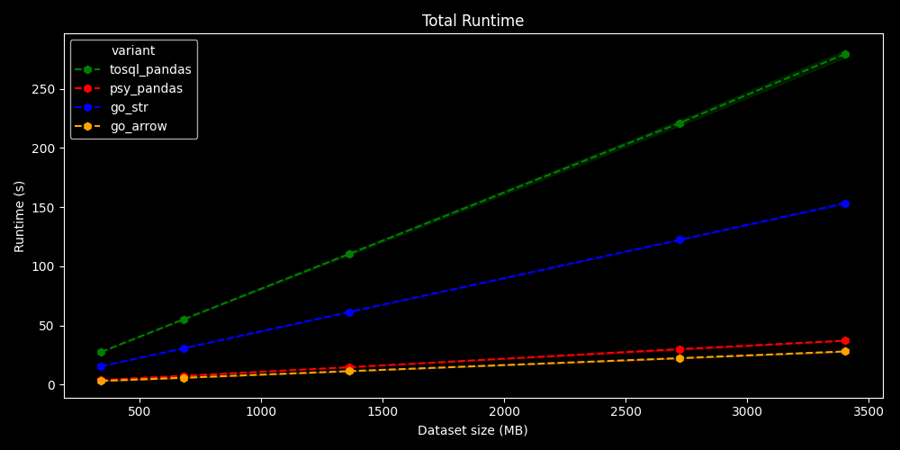
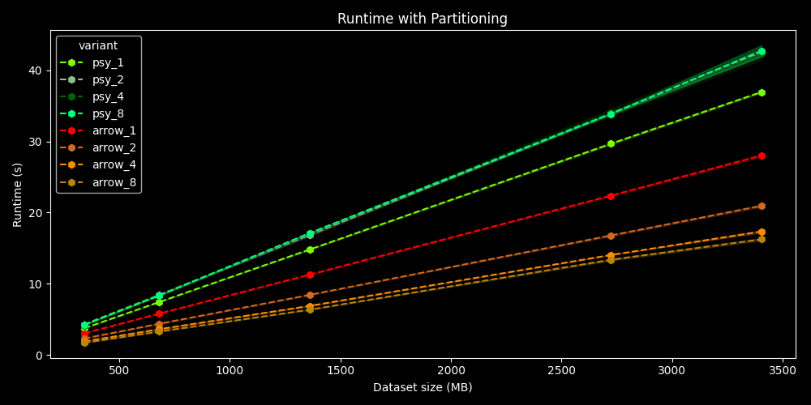

# Thirteen month series 

Each month is a seperated project.

> The name of 13 functions are inspired by the webtoon series Tower of God. 
In Tower of God, the 13 Month Series consists of an inventory (Rainbow Undecimber) and 12 weapons, each named after a month.

## Structure
1. [Silver January](#silver-january)

## Silver January
This project is a part of **Cargo: Efficient writing of dataframes to a Postgres database** 

**Cargo** is a seminar project from **Interoperability in Data Processing Pipelines - Hasso Plattner Institute**.

### Motivation
* `to_sql` is a common step in data science pipelines, but existing solutions are slow and cost a lot of memory
* The paper [ConnectorX: Accelerating Data Loading From Databases to
  Dataframes](https://www.vldb.org/pvldb/vol15/p2994-wang.pdf) speeds up loading process from database to pandas by using `Rust` binding and data partitioning
* We try to reverse the process using `Go` binding and `Goroutines` as data partitioning to speed up writing process from pandas to database

### Architecture

We convert the Pandas Dataframe into Arrow format using `pyarrow.Table.from_pandas()` and then passing the pointer
to the Arrow data to Go using `Ctypes` shared library and `The Arrow C data interface`.

We also use `COPY` command and fastest Go Postgres Driver `pgx`.

For the data partitioning, each `goroutine` will construct, hold the same amount of data, open multiple connection and write data to the database in parallel.

### Evaluation

All solutions are faster than Pandas:
* `Go Arrow`: 10x 
* `Psy`: 7.5x
* `Go CString`: 1.8x

`Go Arrow` is my solution, `Psy` and `Go CString` are my teammates solutions.

With 8 partitions (8 goroutines), `Go Arrow` has more 1.72x improvement (total 17.2x)

My solution also consume 2.1x less memory usage than Pandas (but worse than friends' solutions)

## White February
This project was inspired by **Big Data Systems** course from HPI.

